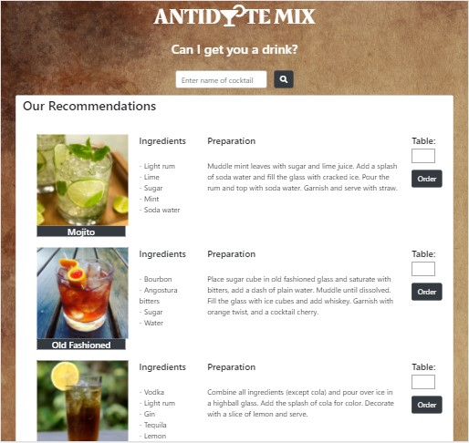
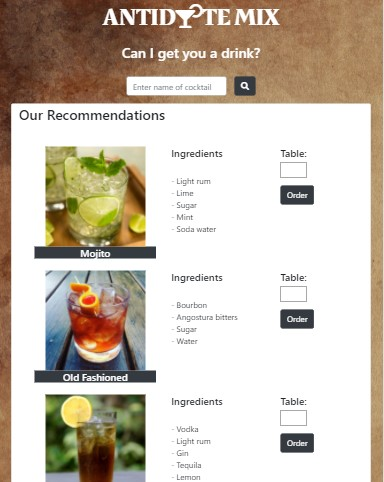
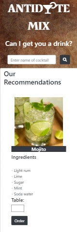
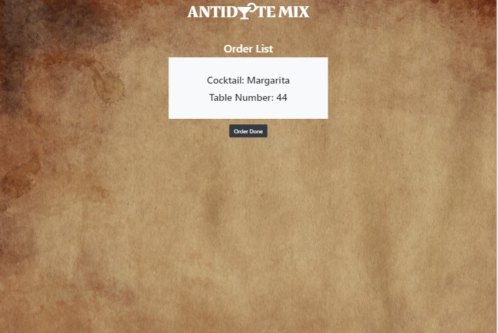
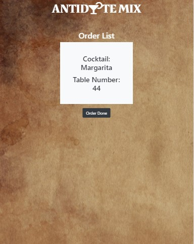
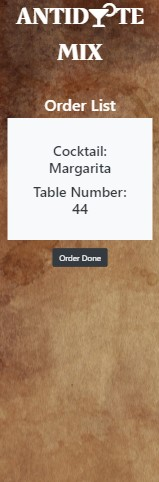

# Antidote Mix Bar
This project focuses on creating a interactive cocktail menu for a Bar called Antidote Mix. The target audience for this menu are the customers of the bar.

Antidote Mix was established in 2010. The bar always believe in evolving and creating the ‘special drink’ for their customers. Till date, the Bar offers up to 500 different types of cocktails. A static paper menu is unable to display the huge list. 

The bar is looking at a interactive menu for their customer to search for their cocktail. The interactive menu also allow the Bar to constantly add in their newest creation without having to reprint the paper menu. 

Details like photos, ingredients and preparation steps of the cocktail will be displayed in the search result to introduce the cocktails to their customer.

The customers are able to order their cocktails directly through the menu without waiting for the waiter to take order thus improving the customer experience and increase the productivity. 

The bartender is able to view the order in the Order page to prepare the cocktail.

The interactive menu is deployed in the link below:  

https://jasonngyt.github.io/Anitdote-Mix/index.html

The order page viewed by the bartender is deployed in the link below:  

https://jasonngyt.github.io/Anitdote-Mix/order.html

## Project Strategy
### UX - User Stories
#### User Stories (Customer)
1) User would like to search for their cocktail easily by keying in the name of the cocktail.
2) User would like to see the recommended cocktails from the bar.
3) User would like to know more about the cocktails such as photos, ingredients and how the drink is prepared.
4) User would like to order their cocktail directly through the menu without waiting for waiter to take order.

#### Organization Goals (Bar)
The society wants to create a interactive menu for better customer experience. As such, the following organization goals have been identified:
1) Organization would like to allow the customers to search through their huge selection of cocktails easily.
2) Organization would like to update their new cocktails constantly into the menu. 
3) Organization would like to recommend their new and popular cocktails by displaying them in the first page of the menu.
4) Organization would like the customers to order directly with the menu. This will cut down manpower resources for ordering, improve productivity and customer experience.

## Project Scope
Based on the user stories and organizational goals identified, these are the following features the website is going to implement:

### Pages/Features
#### Menu
1. A list of popular and new cocktails are displayed under Our Recommendation when the menu is first loaded. Customers can refer to the list if they do not know what to order.
2. Customers are able to search for their cocktails by simply entering the cocktail name and click the search button.
3. The cocktail list are displayed with the cocktail photos, ingredients and preparation steps to introduce the drink to the customers.
4. The bar can add in new cocktail into the JSON list which will then be displayed under Our Recommendation.
5. Customers are able to order the cocktail through the interactive menu by entering their table number and click the order button. 

#### Order Page
1. The bartender is able to view the order in the order page and prepare the cocktail.
2. The bartender is able to clear the order list after he prepared the cocktail and send out the order by clicking the Order Done Button.

## Project Structure
### Wire Frame

The wireframe can be viewed in the link below:  

https://drive.google.com/file/d/1k3HamcNfgsHCmlOxEVWmjauL7kIzhJnb/view

## Project Skeleton
### Existing Features
The layout of the interactive menu, index.html, is kept simple and user friendly for the customer. There is no complicated drop down list or sub category that the customer have to click to look for their cocktail. The default refresh is disabled to prevent the page from reloading so as to speed up the search process and enhance the customer experience.

A list of recommended cocktail is automatically displayed once the page is loaded. This list is loaded from the first set of API, https://www.thecocktaildb.com/api/json/v2/1/popular.php

This list contains all the popular cocktails and the new cocktails recommended for the customers. The bar can add new cocktail into the JSON file and it will appear in Our Recommendation list. It will save the trouble for the Bar of reprinting the paper menu every time they come out with new ‘creation’. Customer can refer to the list for recommended cocktail.

There is text box for customers to enter name of the cocktail that they wish to search. The search button will trigger the search and list out all the cocktail that contains the name. The customer do not have to navigate through any navigation bar or drop down list to look for the drink. The search list is obtained from the second set of API, https://www.thecocktaildb.com/api/json/v1/1/search.php?s= + name of the cocktail

Details such as Cocktail Photo, Ingredients and Preparation Steps are displayed for individual cocktails to introduce the drink to the customers.

There is a order button for individual cocktail. To order the cocktail, the customer can key in their table number click on the order button. The cocktail name and table number will send to the firebase database.

The order page will retrieve this information from the database. Bartender is able to view the cocktail name and table number in the order page. Once the cocktail is prepared and served , the bartender can click on Order Done Button to clear the order.

### Features to implement in the future
1) The current order page takes only one order each time. I will like to add in the feature to take in multiple orders.
2) I wish to add billing feature so that the customer can view their order so far and the bills.
2) I wish to add a user friendly page for the bar to manage their cocktail list, so that they do not have to update through the JSON file. ie. Add/Update/Delete the cocktail from the list.

## Project Surface
The theme that I wished to present is simple and user-friendly interactive menu. Customer do not have go through the hassle of clicking individual drop down list or sub-catalogue to look for their drink. They can simply key in name of the cocktail to find their drink using the search function provided.

### Colours
* Brown, White and Black are the main colors chosen for the menu.
* Brown - The background of the menu is mainly Brown color. The color of earth represent stability, natural and home. This gives the customers relaxing feel when they look through the cocktail list.
* White - The cocktail list is display with white background so that the customer can see clearer in the Bar dim environment. 
* Black - The black search and order button forms a big contrast with the white background which stands out and prompt the user to search or order.

### Logo
The logo of the bar is created using Font Awesome and Google Font. 
The font style Rakkas is chosen which had united style. The Arabic design is inspired by Ruq’ah lettering on Egyptian movie posters from 50s and 60s, and makes use of contextual alternates to emulate calligraphy. The Egyptian Feel presented by the fonts match perfectly with the brown background.
The letter ‘O’ is represented by the cocktail icon from Font Awesome. Customer can easily recognize the shop selling cocktail. The cherry on the cocktail icon is a circle shape which can also replace the letter ‘O’.

### Technologies Used
* HTML4.0, Javascript, Jquery and CSS3 were the main language used in this project.
* Bootstrap was used to make the website mobile responsive.
* Cloud9 was used as the IDE for building the website.
* Repository hosted on GitHub
* The application Postman is used to view the API output.
* Firebase database is used to store the order.

### Libraries
* The icons were taken from Font Awesome.
* The fonts are found in Google Fonts.

### Testing
#### Responsiveness
The Menu and Order page are tested on mobile phone, tablets and desktop. In addition, both pages are tested using different viewport under the inspector tools. The site is fully responsive - it's mobile, tablet and desktop-friendly.

#### Menu Desktop View

#### Menu Tablet View

#### Menu Mobile View

#### Order Page Desktop View

#### Order Page Tablet View

#### Order Page Mobile View

### Browser Compatibility
The application was tested on Firefox and Google Chrome. Both pages functioned satisfactorily on both browsers. 

### Test Cases

| Test Case(s) | Test Description | Outcome | Result |
| --- | --- | --- | --- |
| 1 | Click Index.html to access web page, the list of recommended cocktail should be listed automatically when the page is load.   Make sure that the photos of the cocktail, name, ingredients and instruction do not overlap each other. | The list of recommended cocktail is automatically displayed when the page is load.    The photos of the cocktail, name, ingredients and instruction do not overlap each other. | Pass |
| 2 | Open postman application. Key in the API address under United Request and click the Send Button. https://www.thecocktaildb.com/api/json/v2/1/popular.php   This list contains the popular and new cocktail. The data in the JSON file will be display. Click Index.html to access web page. Compare Our Recommendation list in the web page with the data of JSON.    The following should match:  - strDrinks in the JSON match the cocktail name in the Recommendation list - strDrinkThumbs in the JSON match the photos of the cocktail in the Recommendation list - strIngredients in the JSON match the Ingredient list in Recommendation list.  - strInstructions in the JSON match the Preparation in the Recommendation. | The list under Our Recommendation match with the data of the JSON file.| Pass |
| 3 | Click Index.html to access web page. Enter the name of the cocktail (for example, margarita) in the text box and click on the search button.   Open postman application. Key in the API address under United Request with the name of the cocktail and click the Send Button. https://www.thecocktaildb.com/api/json/v1/1/search.php?s=margarita.  Compare search result in the web page with the data of JSON.  The following should match:  - strDrinks in the JSON match the cocktail name in the search result. - strDrinkThumbs in the JSON match the photos of the cocktail in the search result. - strIngredients in the JSON match the Ingredient list in search result.  - strInstructions in the JSON match the Preparation in the search result. | The search results displayed match the value in the postman application. | Pass |
| 4 | Open index.html with different web browser. Test by using different viewport under the inspector tools, Desktop view, Tablet view, Mobile view.   View the menu using different device, mobile, tablet and laptop.  All the website layout should be mobile responsive and follow the layout as stated in the wireframe. The preparation steps should not be display in the mobile and table view. | The website is mobile responsive with mobile, tablet, desktop and with different browser.  The preparation steps did not display in mobile and tablet view. | Pass |

### Problems Encountered/Bugs solved
* I was unable to load JQuery file through the web link. The JQuery min file is downloaded into the local repository to rectify the problem.
* I was unable to search and display the cocktail list from the second set of API. With reference to similar problems found in stackoverflow, I realized that I need to add in the full parameter, in my case, the ‘drink’ before the element.
* I was only able to display one result at a time. Under the guidance from the lecturer, I realized that I need to put my result in array. The result is place in a ‘For Loop’ to display the multiple results.

## Deployment
This project was written using AWS Cloud IDE and deployed to GitHub.
1. At the start of the project, I created my first index.html file in Cloud9.
2. Next, I opened a new terminal and type in the git init command to initialize a local repository.
3. A new remote repository was created with a name Antidote Mix.
4. After creating the repository in GitHub, I copy the code given back in Cloud9 to link the local repository to the remote one.
5. Under the new terminal in Cloud9, the index.html is added using the git add command.
6. I typed in the command git commit -m “Initial commit”, which puts the file into the staging area for the first commit.
7. Next, I used the git push command to send the file to the remote repository.
8. The terminal will prompt for the username and password.
9. The command git add, git commit -m “message” and git push are used to saved the rest of the files and pictures to the remote repository.
10. I tried to push the code regularly to Github every time there is any updates to the files. It served as a backup as I know I can go back to my history to retrieve my earlier codes if I messed up my current codes in Cloud9.

## Credits
* The cocktail photos, Ingredients and Preparation Steps are taken from API from The CocktailDB
* The background photo was obtained from a stock image library called Pixels.
* The problems are resolved with reference to similar problems faced by other programmer in Stackoverflow as well as advises from lecturers.
* The styling and features were made with reference to the tutorial from W3schools.